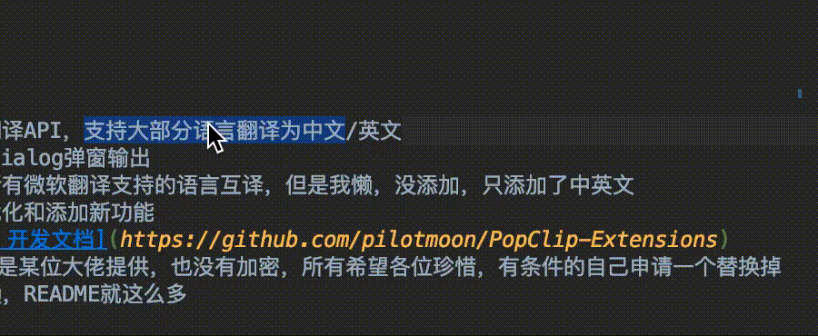
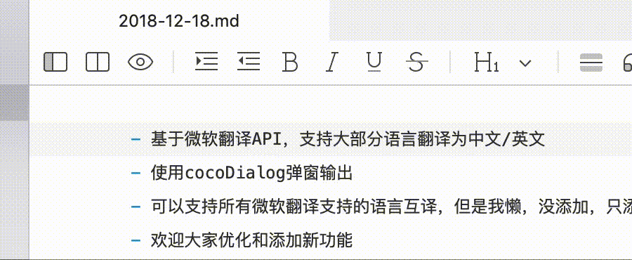

# PopClip的有道翻译插件

## 效果预览

### 设置菜单
   

### 居中弹窗
   

### 右上通知
   

## 说明

- 基于有道翻译API，支持大部分语言翻译为中文/英文
- 使用cocoDialog弹窗输出
- 可以支持所有有道翻译支持的语言互译
- 欢迎大家优化和添加新功能
- [PopClip 开发文档](https://github.com/pilotmoon/PopClip-Extensions)
- 里面的APP_KEY,APP_SECRET需自行替换
- 自适应弹窗，当单词数量大于5时，居中弹窗，否则，右上通知
